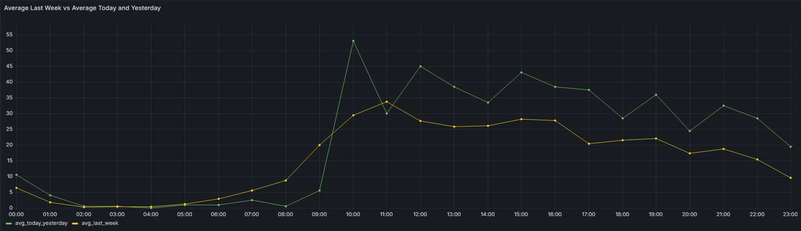
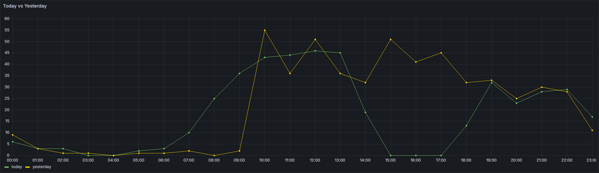
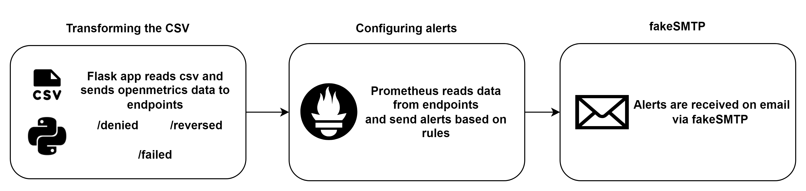

# Monitoring analyst test
## 1 - Data analysis
### First case - No anomalies
Upon analysis of the data, no anomalies were detected. The current week shows promising numbers, with today's and yesterday's figures averaging approximately 28% higher than last week's.  

``` SELECT time, (today + yesterday) / 2 AS avg_today_yesterday, avg_last_week FROM checkout```




### Second case - Anomaly detected
In contrast to the initial findings, a potential outage occurred in the system between 15:00 and 17:00, as evidenced by three consecutive zero values.

``` SELECT time, today, yesterday FROM checkout ```



## 2 - Solve the problem
### Solution Diagram



To solve the problem, we've divided the solution into three main steps:

1. **Transforming the CSV**: 
   - In this initial step, we utilize a Python script.
   - The script reads the CSV file and extracts lines corresponding to the current moment.
   - For instance, if it's 16:00, the script searches the CSV for lines from 16:00.
   - The extracted lines are then sorted and fed into specific endpoints based on their respective statuses.
   - Endpoints are divided into `/reversed`, `/failed`, and `/denied` categories.


2. **Configuring alerts**: 
   - In this step, we utilize a both Prometheus and alertmanager.
   - 3 different rules are set on Prometheus, each one pointing to an endpoint.
   - Prometheus' intervals are set to 1 minute to gather info minute to minute.
   - Alertmanager's intervals are set to 1 minute, so they can check info on a minute-to-minute basis.
   - Alertmanager connects and sends emails to fakeSMTP, in this case, hosted in localhost:1025.


3. **fakeSMTP**: 
   - fakeSMTP is being hosted locally via Docker on port 1025 to receive and display the emails.

